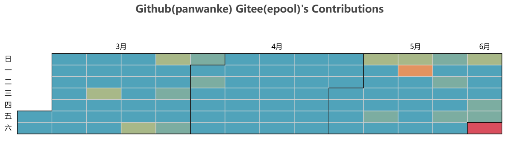

# Get contibution from GitHub and Gitee

[github link](https://github.com/panwanke/merge-git-contribution)

## Project Purpose
This project aims to provide a data scrapy and visualization of contributions made to GitHub and Gitee repositories. By merging contributions from both platforms, users can gain insights into their coding activities and trends over a specified period.

> Premise:
> The contribution heatmap of Github and Gitee are accessible by the public.
> And if you want to get private contribution, you should check this option. 

## Usage
To use this project, follow the steps below:

1. **Clone the Repository**:
   ```bash
   git clone https://github.com/panwanke/merge-git-contribution
   cd merge-git-contribution
   ```

2. **Install Dependencies**:
   Ensure you have all the required libraries installed. You can use `pip` to install them:
   ```bash
   pip install -r requirements.txt
   ```

3. **Run the Example Code in [plot_contribution.ipynb](./plot_contribution.ipynb)**:


  Here’s an example of how to use the `giteehubContri` module
   Modify the script as needed, especially the `github_username`, `gitee_username`, and `start_date` parameters. Then, execute the script:

```python
from giteehubContri import myContribution

start_date = "2024-03-01"
mycontr = myContribution(username="username", start_date=start_date)
# mycontr = myContribution(github_username="github_username", gitee_username="gitee_username", start_date=start_date)
github_contribution = mycontr.get_github_contributions()
gitee_contribution = mycontr.get_gitee_contributions()
merged_contributions = mycontr.merge_contributions(github_contribution, gitee_contribution)
render = mycontr.plot_contributions(merged_contributions, render_type="notebook")
render.render_notebook()
render.render("my_contributions.html")
```



## Core Files Description


- **`giteehubContri.py`**: The main script that contains the logic for fetching, merging, and plotting contributions from GitHub and Gitee.
- **`my_contributions.html`**: The output HTML file that visualizes the merged contributions.
- **`plot_contribution.ipynb`**: A Jupyter Notebook that provides an interactive environment to run and visualize the contribution analysis.


## Acknowledgements

Thanks for github api from https://github.com/grubersjoe/github-contributions-api


## License
This project is licensed under the MIT License - see the [LICENSE](LICENSE) file for details.

---

Feel free to modify any section as per your project specifics!