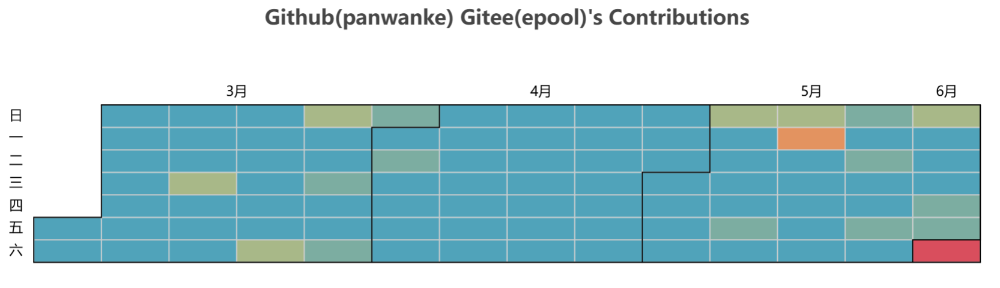

# 如何用GitHub和Gitee炫耀你的代码贡献：一个工具介绍 🎉

大家好！今天我要给大家介绍一个超级实用的工具，它能帮你把GitHub和Gitee上的代码贡献合并起来，生成漂亮的可视化图表，让你在朋友面前装逼不再是梦！😎

## 项目目的
这个项目的目标是提供一个数据爬取和可视化工具，用于展示你在GitHub和Gitee上的代码贡献。通过合并两个平台的贡献数据，你可以深入了解自己在指定时间段内的编码活动和趋势。

> 前提：
> GitHub和Gitee的贡献热图是公开可访问的。
> 如果你想获取私有贡献数据，请确保你已经勾选了相关选项。

## 使用方法
要使用这个项目，请按照以下步骤操作：

1. **克隆仓库**：
   ```bash
   git clone https://github.com/panwanke/merge-git-contribution
   cd merge-git-contribution
   ```

2. **安装依赖**：
   确保你已经安装了所有需要的库。你可以使用 `pip` 来安装它们：
   ```bash
   pip install -r requirements.txt
   ```

3. **运行示例代码 [plot_contribution.ipynb](./plot_contribution.ipynb)**：
   这是一个如何使用 `giteehubContri` 模块的示例代码。根据需要修改脚本，特别是 `github_username`、`gitee_username` 和 `start_date` 参数。然后，执行脚本：

```python
from giteehubContri import myContribution

start_date = "2024-03-01"
mycontr = myContribution(username="username", start_date=start_date)
# mycontr = myContribution(github_username="github_username", gitee_username="gitee_username", start_date=start_date)
github_contribution = mycontr.get_github_contributions()
gitee_contribution = mycontr.get_gitee_contributions()
merged_contributions = mycontr.merge_contributions(github_contribution, gitee_contribution)
render = mycontr.plot_contributions(merged_contributions, render_type="notebook")
render.render_notebook()
render.render("my_contributions.html")
```


## 核心文件描述

- **`giteehubContri.py`**：主要脚本，包含获取、合并和绘制GitHub和Gitee贡献数据的逻辑。
- **`my_contributions.html`**：输出的HTML文件，展示合并后的贡献数据。
- **`plot_contribution.ipynb`**：一个Jupyter Notebook，提供交互环境来运行和可视化贡献分析。

### 结语
这个工具不仅能帮你更好地了解自己的编码习惯，还能在朋友面前大秀特秀！赶紧试试吧，让你的代码贡献图表炫起来！💻✨